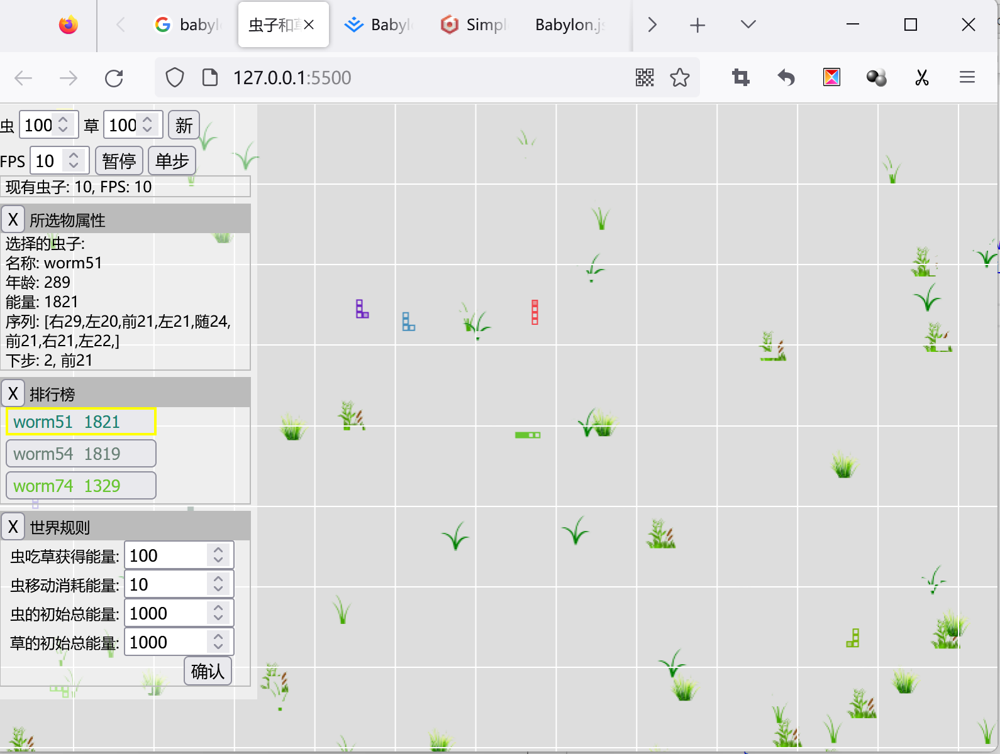

# WormAndGrass



## 开发语言和库
---
基于JavaScript运行环境 -- Web已经是基础设施, 可视化交互化是Web的核心功能

使用TypeScript语言开发 -- TS语言非侵入，柔和支持ES更高版本的进化

暂时选择 PIXI.js -- 
    1. 如今是GPU时代, 需要利用已经普及的更好的硬件GPU
    2. 专注于 WebGL 2D引擎, Three.js 和 Babylon.js 更偏向3D
    3. Babylon.js肯定比 Three.js 好, 如果有好办法能将3D降维为2D是一个不错的选择

GUI 选择 https://github.com/dataarts/dat.gui
    1. 一种方案是 DOM
    2. Babylon.js自己带 GUI


## 开发环境搭建
---
尽量最少的依赖：目前看只需要将ts文件自带编译为js就可以，选择用esbuild

1. ### 安装配置VSCode 1.74.2
    LiveServer插件 用来启动 Web Server
2. ### 安装配置 Node
    nodejs.org下载 18.12.1  LTS

    windows cmd：npm config list

    设置npm安装程序时的默认位置

    ```
    npm config set prefix "D:\npm_modules\global" 
    ```
    设置npm安装程序时的缓存位置
    ```
    npm config set cache "D:\npm_modules\cache" 
    ```
    把 D:\nodejs\node_global 加到 window s系统 PATH 下

    设置淘宝源镜像
    ```
    npm config set registry https://registry.npm.taobao.org
    ```

3. ### 安装 esbuild
    ```
    npm install -g esbuild 
    ```

    确认 esbuild
    ```
    esbuild --version
    ```
    如果在vscode终端报错，“。。。因为在此系统上禁止运行脚本”，是powershell问题，在改该powershell终端下
    ```
    Set-ExecutionPolicy -Scope CurrentUser
    输入：RemoteSigned
    ```
    尝试是否能正常将ts文件转换位js文件
    ```
    esbuild .\js\test.ts --bundle --outfile=".\js\test.js"
    ```

4. ### 运行
    + 在VSCode **CTRL + `** 启动终端
    + 在终端输入 **node ./run_esbuild.js** 将启动实时编译 ts 文件，如果有新增 ts 文件需要在 run_esbuild.js中增加
    + 在VSCode 左下 点击 "Go Live" 启动 Live Server将在浏览器中启动 127.0.0.1:5500/

5. ### 待参考
```
https://gist.github.com/dmnsgn/76878ba6903cf15789b712464875cfdc

https://forums.rpgmakerweb.com/index.php?threads/candy-tiles-and-enemies-for-mv.129155/
https://www.orillusion.com/zh/
https://www.youtube.com/watch?v=y2dZYG5YTRU
https://www.youtube.com/watch?v=-hXtt4ioH5A&list=PL_UrKDEhALdKh0118flOjuAnVIGKFUJXN

纯WebGL: https://wow.techbrood.com/uploads/2101/perf_test/webgl.html

地图编辑器: https://www.mapeditor.org/

https://www.youtube.com/watch?v=s6qDhp4dxeM
https://www.youtube.com/watch?v=2p7v-bdS2bo
https://www.youtube.com/playlist?list=PLv8Ddw9K0JPiTHLMQw31Yh4qyTAcHRnJx
https://www.youtube.com/watch?v=alcxketz6vQ
https://www.youtube.com/watch?v=adixpp9CK_A
https://github.com/greggman/twgl.js
https://github.com/polar-js/polar.js
```
